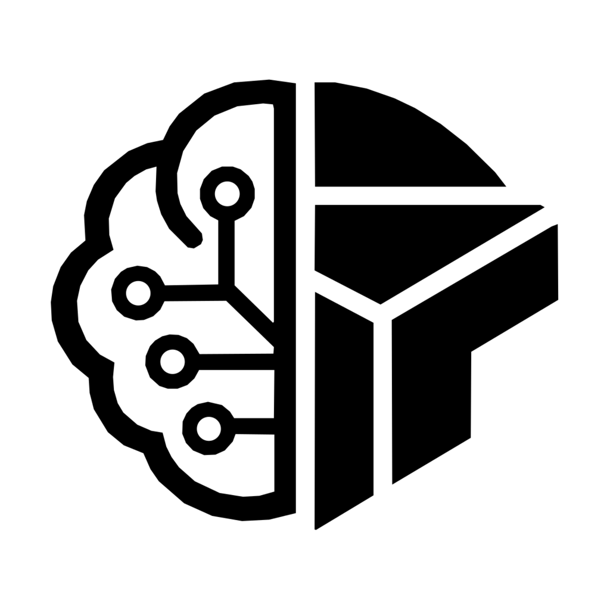
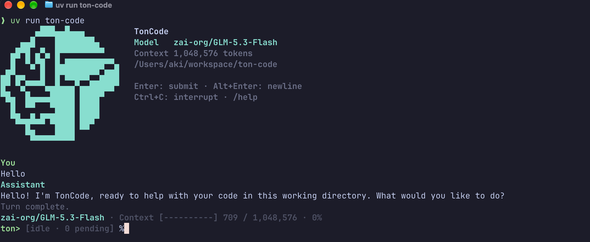

<div align="center">
  
  <h1>TonCode</h1>
  <h3>A barebone coding agent from TonAI</h3>
</div>

TonCode is a minimal Pydantic AI coding agent with a Rich terminal transcript.
Output appends to normal terminal scrollback while the input prompt stays editable.

<div align="center">
  
</div>

## Quick start

Requires Python 3.14 or newer.

```sh
uv sync
```

Configure an OpenAI-compatible server in `.env`:

```dotenv
LLM_PROVIDER=openai
MODEL_ENDPOINT_URL=http://localhost:8000
MODEL_ENDPOINT_MODEL=your-model
# Optional for servers that require authentication:
MODEL_ENDPOINT_API_KEY=
```

Then start the agent:

```sh
uv run ton-code
# Also available as:
uv run python -m src
```

The endpoint can include `/v1`. To use Gemini, configure `.env` instead as:

```dotenv
LLM_PROVIDER=gemini
GEMINI_API_KEY=your-api-key
GEMINI_MODEL=gemini-3.5-flash
```

## Launch from any directory

Install the command once into your user tool environment:

```sh
uv tool install --python 3.14 --editable /path/to/ton-code
```

Store shared provider configuration in `~/.config/ton-code/.env`. You can copy
the configuration from your existing installation:

```sh
mkdir -p ~/.config/ton-code
cp /path/to/ton-code/.env ~/.config/ton-code/.env
```

Then launch `ton-code` from the project you want the agent to work on:

```sh
cd /path/to/your-project
ton-code
```

Alternatively, use this repository's virtual environment and existing `.env`
without installing a global command:

```sh
cd /path/to/your-project
/path/to/ton-code/.venv/bin/ton-code --env-file /path/to/ton-code/.env
```

Configuration precedence is: exported environment variables, the launch
directory's `.env`, then `~/.config/ton-code/.env`, then defaults. `--env-file`
replaces automatic file discovery; exported variables still take priority.
Configuration location does not change the workspace: tools and default session
logs use the directory where you launch TonCode.

## CLI options

| Option | Behavior |
| --- | --- |
| `--model MODEL` | Override the configured provider's model for this session |
| `--env-file FILE` | Use a specific configuration file instead of global and local files |
| `--verbose` | Show thinking, full emitted tool results, and tracebacks |
| `--version` | Print the application version |
| `--help` | Show command usage |

Tool execution uses the existing agent policy: file changes and shell commands
run without confirmation.

## Input and output

| Action | Behavior |
| --- | --- |
| Enter | Submit the message |
| Alt+Enter | Insert a newline |
| Paste | Preserve pasted newlines as one message |
| Ctrl+C while working | Interrupt the agent and terminate its active shell process group |
| Ctrl+C while idle | Clear the input draft |
| Ctrl+D on an empty draft | Exit |
| `/help` | Show controls and commands |
| `/clear` | Reset conversation history; retain terminal scrollback |
| `/compact` | Summarize older conversation history |
| `/quit` | Interrupt active work and exit |

Messages submitted while working steer the active task at its next model request.
Late messages are picked up before the turn ends. Pending messages are discarded
on interruption or error, with a notice so they can be resubmitted.
`/clear` and `/compact` require an idle agent.

Assistant text streams as complete lines; the final fragment prints at the next
visible event or turn completion. Markdown remains plain text. Tool results show
up to 10 lines and 2,000 characters by default; `--verbose` shows everything the
tool emits, including any truncation already applied by the tool itself.


Context counts use the latest model request's input usage, including cache reads;
they are not cumulative session totals. Usage updates after each model response.
`~` marks an estimate when provider usage is missing or history was compacted.
`/clear` resets the context count while retaining terminal scrollback. The bar
turns yellow at 80% usage and red at 90% usage.
Unknown model windows are labelled as assumed; set
`COMPACTION_CONTEXT_WINDOW_TOKENS` in your configuration to supply the model's
actual capacity. Narrow terminals show a shorter `ctx 30%` label (`*` means the
window is assumed).

Conversation messages and compaction checkpoints are saved under `.agents/sessions`
by default. Session resume and redirected input/output are not supported by this UI.

## Offline checks

```sh
uv run python -m unittest discover -v
```

Tests cover renderer output, agent steering, subprocess cancellation, session
persistence, configuration precedence, context display, and typing/paste during
streamed output in a pseudo-terminal.
